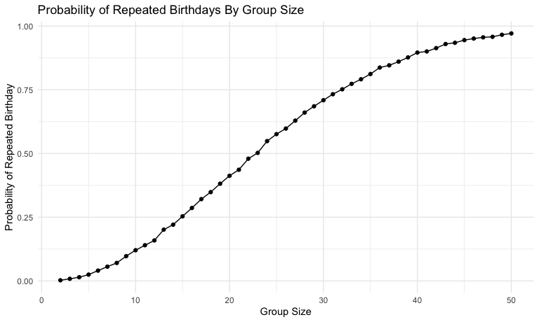

P8105 Homework 5
================
Maria Serafini

## Problem 1

The code below creates a function that, for a fixed group size, randomly
draws “birthdays” for each person, checks whether there are duplicate
birthdays in the group, and returns `TRUE` or `FALSE` based on the
result.

``` r
bday_sim = function(n_room) {
  
  birthdays = sample(1:365, n_room, replace = TRUE)

  repeated_bday = length(unique(birthdays)) < n_room

  repeated_bday
  
}
```

The code below runs the `bday_sim` function 10,000 times for each group
size between 2 and 50, and computes the probability that at least two
people in a given group will share a birthday.

``` r
bday_sim_results <- 
  expand_grid(
    bdays = 2:50,
    iter = 1:10000
  ) |> 
  mutate(
    result = map_lgl(bdays, bday_sim)
  ) |> 
  group_by(
    bdays
  ) |> 
  summarize(
    prob_repeat = mean(result)
  ) |> 
  view()
```

This plot shows the probability calculated above as a function of group
size.

``` r
bday_sim_results |> 
  ggplot(aes(x = bdays, y = prob_repeat)) +
  geom_point() +
  geom_line()
```



From the plot we can see that as group size increases, the probability
that at least two people will share a birthday increases. There is a 25%
chance of at least two people sharing a birthday once the group size
reaches approximately 15, a 50% chance once the group size reaches
approximately 23, a 75% chance once the group size reaches approximately
32, and close to a 100% chance once the group passes approximately 50.
These results indicate that a large sample size is not necessarily
needed for two people to likely share a birthday.

## Problem 2

The code below creates a function that simulates a dataset from a normal
distribution with a specified mean, runs a one-sample t-test of
$H_0: \mu = 0$ and returns the estimated sample mean and the p-value
from the test.

``` r
sim_power = function(mu, n_subj = 30, sigma = 5) {
  
  sim_result = t.test(rnorm(n_subj, mean = mu, sd = sigma), mu = 0)
  
  sim_result_tidy <- broom::tidy(sim_result)
  
  tibble(
      mu_hat = pull(sim_result_tidy, estimate),
      p_value = pull(sim_result_tidy, p.value))
}
```

The code below generates 5000 simulated datasets under the model
$X \sim N(\mu, \sigma)$ with $n = 30$, $\sigma = 5$, and $\mu = 0$. For
each iteration, it calls the `sim_power()` function to draw a sample and
run a one-sample t-test of $H_0: \mu = 0$. The resulting tibble contains
the estimated sample means and p-values for all 5000 simulated datasets.

``` r
sim_power_results_df <-
  expand_grid(
    mu = 0,
    iter = 1:5000
  ) |>
  mutate(
    results = map(mu, sim_power)
  ) |>
  unnest(results)
```

The code below repeats the simulation for $\mu = 0{:}6$, generating 5000
datasets for each mean from the model $X \sim N(\mu, \sigma)$ with
$n = 30$ and $\sigma = 5$, For every dataset, it runs a one-sample
t-test of $H_0: \mu = 0$ and records the estimated mean and p-value.

``` r
sim_power_results_df <-
  expand_grid(
    mu = 0,
    iter = 1:5000
  ) |>
  mutate(
    results = map(mu, sim_power)
  ) |>
  unnest(results)
```

From the plot below, we can see that as the true value of μ increases
(i.e., as the effect size becomes larger), the power of the test
increases. When μ = 0, the proportion of rejections is close to the
nominal significance level of 0.05, and as μ increases, the probability
of rejecting the null hypothesis approaches 1. This illustrates that
larger effect sizes are easier to detect with a one-sample t-test.

``` r
power_by_mu <-
  sim_power_results_df |>
  group_by(mu) |>
  summarize(
    power = mean(p_value < 0.05),
    .groups = "drop"
  ) |> 
  ggplot(aes(x = mu, y = power)) +
  geom_line() +
  geom_point() +
  labs(
    x = "True Value of μ",
    y = "Power (Probability of Rejecting False Null Hypothesis)",
    title = "Power of One-sample t-test as a Function of Effect Size"
  )
```
